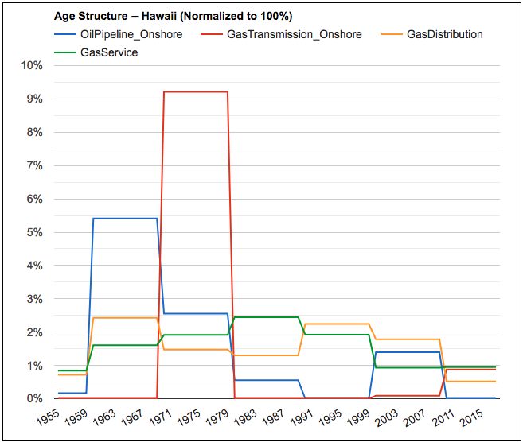

# SWITCH {supply chain}

[](http://www.pyomo.org/)


SWITCH is a open source multi-decades electricity planning model that simulates large integration of renewable energy. 

SWITCH {supply chain} introduces sticky assets along the energy supply chain -- from extraction wells, refineries to pipelines -- to model how the least costly transition pathway away from fossil fuel could be affect by the age structure and service lives of these assets. 



# New Features!
  - Integrate upstream and midstream extraction assets age structure and service life -- oil and gas wells, petroluem and product pipelines, natural gas transmission, distribution and service lines
  - Separate assets from those involved in extraction and transport in the mainland US and those in Hawaii  
  - Allow LNG terminals for a given threshold of natural gas demand

# Todo 
  - Enable simulation of large fleet of electric vehicles 
  - Simulate nuclear power plants buildout 

### Tech

SWITCH is run on Python Pyomo with user's own choice of solver. 

* [CPLEX] -  performance is better than Gurobi and licenses are available for free for the [academia] 
* [Gurobi] -  license is more easily obtained 
    ```
    conda install -c conda-forge glpk
    ```


### Installation and setup

See the official SWITCH documentation on [documentation] for more details.
* install Switch and other Python packages. 
    ```
    pip install switch-model
    ```
* download the SWITCH-Hawaii model and a matching version of the SWITCH model code
    ```
    git clone --recursive https://github.com/switch-hawaii/main.git
    ```
* install the SWITCH model code and required Python packages
    ```
    cd main
    cd switch
    pip install --editable .
    cd ..
    ```
* setup the solver by changing the --solver flag under options.txt 


# Run the model 
```
switch solve --inputs-dir inputs-directory --outputs-dir outputs-directory
```
This command kicks off the model. Users can specify particular modules to set the parameter and constraints for the optimization solvers by editing options.txt and modules.txt. 


[//]: # (These are reference links used in the body of this note and get stripped out when the markdown processor does its job. There is no need to format nicely because it shouldn't be seen. Thanks SO - http://stackoverflow.com/questions/4823468/store-comments-in-markdown-syntax)


   [CPLEX]: <https://www.ibm.com/analytics/cplex-optimizer>
   [Gurobi]: <http://www.gurobi.com/registration/academic-license-reg/>
   [documentation]: <https://github.com/switch-hawaii/>
   [academia]: <https://www.ibm.com/developerworks/community/blogs/jfp/entry/CPLEX_Is_Free_For_Students?lang=en>
